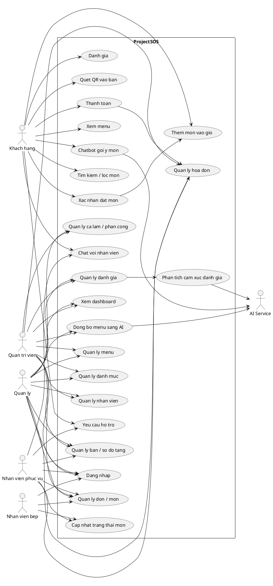
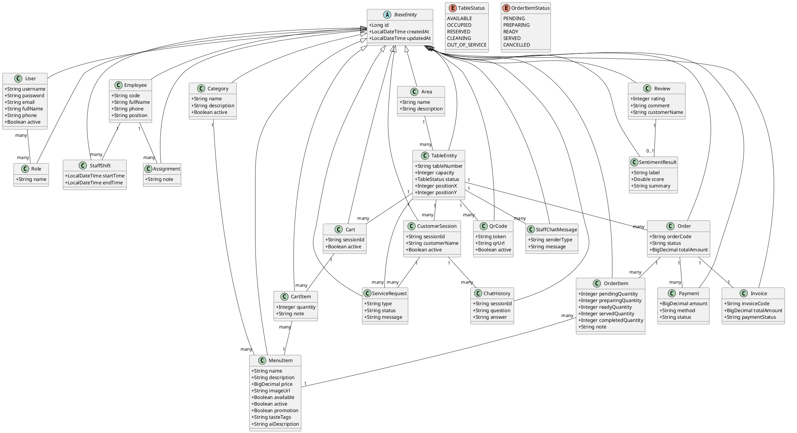
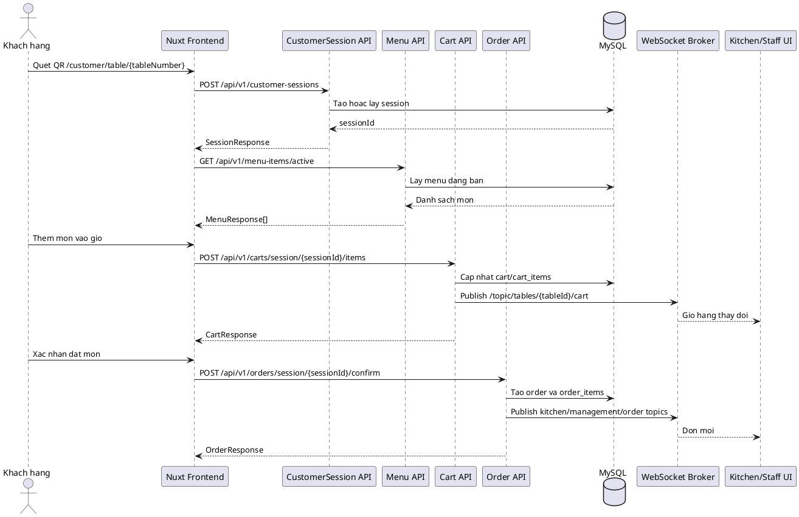
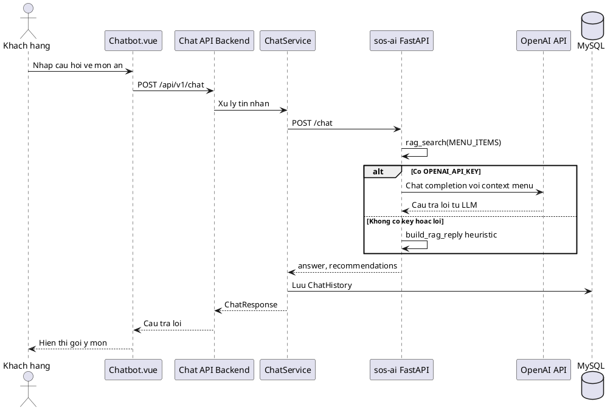
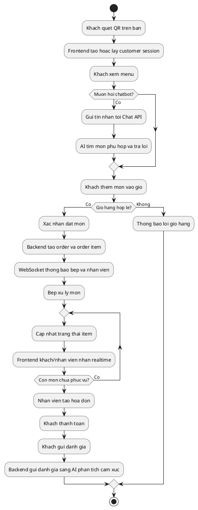
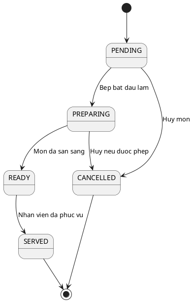
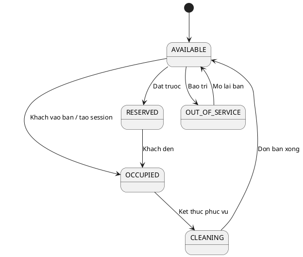
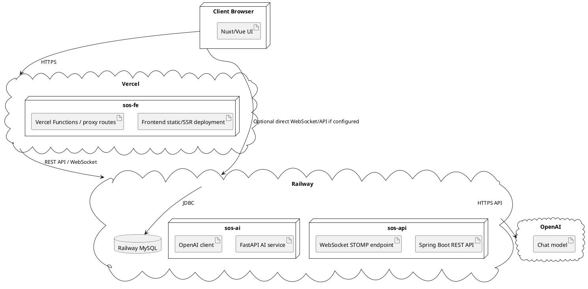
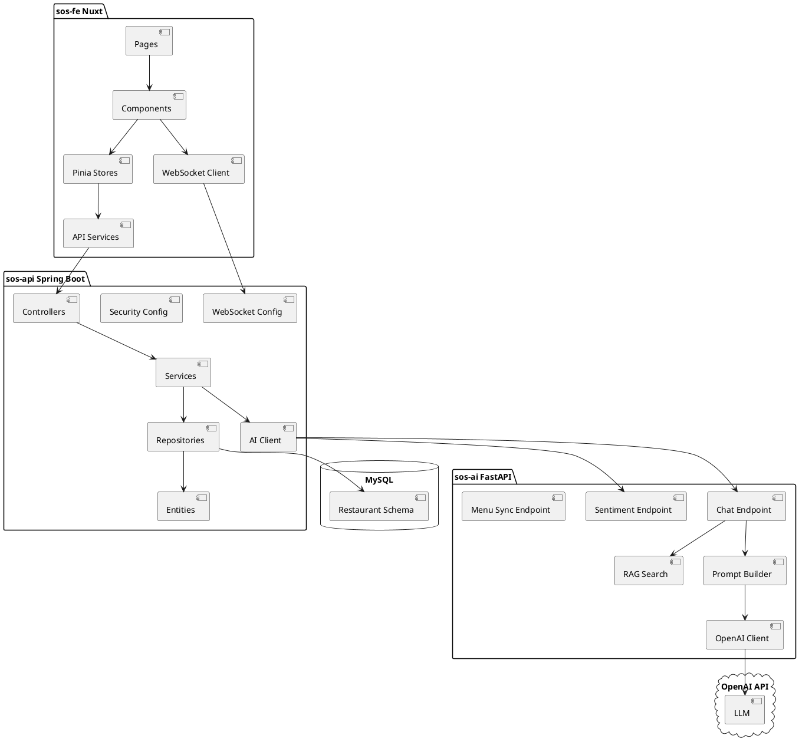

# UML

Tài liệu này chỉ chứa mã PlantUML, không sinh hình ảnh. Có thể copy từng khối vào PlantUML, IntelliJ PlantUML plugin, VS Code PlantUML extension hoặc plantuml.com để render.

## Use Case Diagram

## Class Diagram

## Sequence Diagram - Khach dat mon qua QR

## Sequence Diagram - Chatbot AI

## Activity Diagram - Quy trinh nha hang

## State Diagram - Trang thai mon trong don

## State Diagram - Trang thai ban

## Deployment Diagram

## Component Diagram

